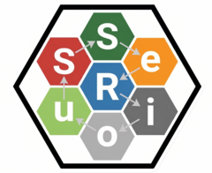

# SeRiouS

# SeRiouS 

🎲 Bienvenue dans SeRiouS !
SeRiouS n'est pas un package R classique : c'est un tutoriel interactif conçu comme un plateau de jeu.

Le but ? Vous apprendre à lier l'analyse de données avec l'intelligence artificielle, sans jamais 
perdre le contrôle sur vos résultats. Nous allons utiliser un écosystème d'outils (FactoMineR, EnTraineR et NaileR) 
pour analyser un jeu de données autour de l'alimentation.

## Objectif pédagogique

L’objectif de **SeRiouS** est de vous aider à comprendre comment passer :

1. d’une analyse statistique classique ;
2. à la récupération structurée des sorties R ;
3. à la construction de prompts contrôlés ;
4. à l’utilisation de fonctions d’aide à l’interprétation ;
5. puis à l’interprétation de variables latentes.

Le fil conducteur du tutoriel est le suivant :

```text
Statistiques explicites
→ sorties R
→ prompts
→ EnTraineR
→ condes() / catdes()
→ NaileR
→ ACP / HCPC
→ classes latentes
→ analyse textuelle contextualisée
```

## Contenu du tutoriel

Le plateau interactif va vous guider à travers plusieurs étapes :

* découverte du questionnaire ;
* exploration de variables quantitatives, qualitatives et textuelles ;
* régression linéaire avec `FactoMineR::LinearModel()` ;
* analyse de variance avec `FactoMineR::AovSum()` ;
* récupération des sorties statistiques dans des objets R ;
* construction manuelle de prompts ;
* introduction à **EnTraineR** ;
* passage d’analyses simples à des analyses systématiques ;
* utilisation de `condes()` et `catdes()` dans **FactoMineR** ;
* introduction à **NaileR** ;
* construction d’une typologie par ACP et CAH ;
* description statistique des classes ;
* préparation des données textuelles par classe ;
* synthèse contextualisée à partir d’artefacts textuels et structurés.

## Jeu de données inclus

Le package inclut un jeu de données simulé :

```r
questionnaire_alimentaire_typologie_textes
```

Ce jeu de données contient un questionnaire alimentaire fictif avec :

* des variables quantitatives d’évaluation du produit ;
* des variables décrivant le rapport à l’alimentation ;
* des variables qualitatives de contexte ;
* une variable textuelle de commentaire libre.

Le jeu de données est utilisé comme fil rouge dans tout le tutoriel.

## Installation

Le package peut être installé depuis GitHub avec :

```r
install.packages("remotes")
remotes::install_github("Sebastien-Le/SeRiouS")
```

## Lancer le tutoriel

Après installation :

```r
library(SeRiouS)

run_plateau()
```

L’application Shiny s’ouvre alors dans le navigateur.

## Dépendances principales

Le package utilise notamment :

* `shiny`
* `visNetwork`
* `FactoMineR`

Les packages suivants peuvent être utilisés dans certaines étapes du tutoriel :

* `EnTraineR`
* `NaileR`

Selon l’installation locale, certaines étapes utilisant **EnTraineR** ou **NaileR** peuvent être présentées comme démonstrations ou exécutées si les packages sont disponibles.

## Organisation du package

La structure principale du package est la suivante :

```text
SeRiouS/
├── R/
│   ├── run_plateau.R
│   └── data.R
├── data/
│   └── questionnaire_alimentaire_typologie_textes.rda
├── inst/
│   └── app/
│       ├── app.R
│       └── www/
│           ├── styles.css
│           └── fichiers PDF de support
├── data-raw/
│   └── scripts de génération des données
└── DESCRIPTION
```

L’application Shiny est située dans :

```text
inst/app/app.R
```

Les fichiers statiques utilisés par l’application, comme le CSS ou les PDF, sont placés dans :

```text
inst/app/www/
```

## Utilisation en atelier

Le tutoriel est conçu pour être utilisé en séance projetée ou en autonomie guidée.

Chaque case du plateau contient :

* un objectif pédagogique ;
* une question de déverrouillage ;
* un bloc de code R ;
* une sortie console ;
* parfois un graphique ;
* parfois un support PDF ;
* une transition vers l’étape suivante.

Le système de progression permet de découvrir le code progressivement, au lieu de fournir un script complet dès le départ.

## Philosophie pédagogique

**SeRiouS** repose sur une idée centrale : les modèles de langage peuvent aider à interpréter des résultats statistiques, 
mais ils ne doivent pas être utilisés comme de simples générateurs de réponses.

Le tutoriel insiste donc sur les objets intermédiaires :

```text
résultats statistiques
→ sorties récupérées
→ textes capturés
→ prompts contrôlés
→ artefacts structurés
→ interprétation contextualisée
```

Ces objets rendent le workflow plus visible et plus contrôlable.

Plutôt que de jeter vos données brutes à l'IA, le plateau va vous forcer à créer des objets intermédiaires 
(des résumés statistiques, des textes préparés, des artefacts). C'est vous qui faites l'analyse, 
c'est vous qui structurez les résultats, et l'IA n'intervient qu'à la toute fin pour vous aider 
à contextualiser. Vous restez les pilotes !

## Comment lancer la partie ?

1. Installation (à faire une seule fois) :
Ouvrez RStudio et tapez ces lignes dans votre console :

```r
install.packages("remotes")
remotes::install_github("Sebastien-Le/SeRiouS")
```

2. Démarrer le jeu :
À chaque début de séance, il vous suffira de charger le package et de lancer le plateau interactif :

```r
library(SeRiouS)
run_plateau()
```

Une fenêtre s'ouvrira dans votre navigateur. Chaque case du plateau vous donnera un objectif, un petit défi pour débloquer la suite, et le code R dont vous avez besoin pour avancer.

Bonne partie !

## Auteur

Sébastien Lê
Institut Agro Rennes-Angers

## Licence

Ce package est distribué sous licence MIT.

