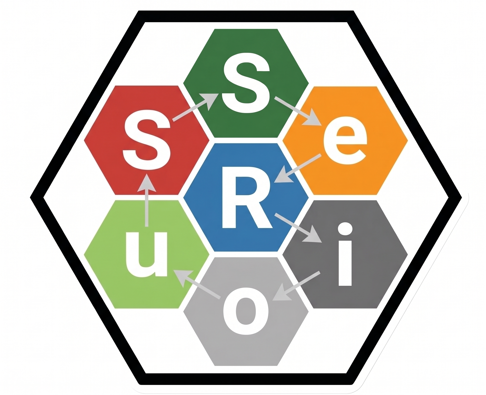

# SeRiouS 

**SeRiouS** is an R package for creating, running, validating, and sharing
interactive learning capsules built with **Shiny**.

A SeRiouS capsule is a small pedagogical application organized as a
board-game-like sequence of steps. Each step may contain a learning objective,
a question to unlock the step, R code, console output, plots, and additional
resources such as PDF files.

> SeRiouS provides the stage.  
> The user writes the play.

## Overview

SeRiouS is designed for teachers, trainers, and researchers who want to build
progressive, interactive learning activities in R.

The package provides tools to:

- define learning steps;
- organize them into a board;
- lock and unlock steps with questions;
- execute R code inside a controlled tutorial environment;
- display console output, plots, and PDF resources;
- validate capsule structure before distribution;
- run capsules locally as Shiny applications;
- export simple capsules as standalone Shiny applications;
- optionally export compatible capsules to `shinylive`.

SeRiouS is not tied to a single tutorial. It can be used to build different
types of learning capsules, from small demonstrations to longer training
workflows.

## Installation

You can install the development version from GitHub with:

```r
install.packages("remotes")
remotes::install_github("Sebastien-Le/SeRiouS")
```

Then load the package:

```r
library(SeRiouS)
```

## Available capsules

SeRiouS includes a few internal demonstration capsules.

```r
available_capsules()
```
A capsule can be retrieved with:

```r
capsule <- get_capsule("demo_iris")
```
and validated with:

```r
validate_capsule(capsule)
```

## Run a capsule locally

To run a capsule as a local Shiny application:

```r
run_learning_capsule("demo_iris")
```

You can also run another internal capsule:

```r
run_learning_capsule("demo_pca")
```

The application opens in a browser and displays a board of learning steps.
Only the first step is unlocked at the beginning. Locked steps can be unlocked
by answering their associated questions. Running a step executes its R code and
displays the corresponding output.

## Create a simple capsule 

A SeRiouS capsule is made of steps.

```r
step1 <- make_step(
  id = "intro",
  title = "Inspect the data",
  section = "data",
  objective = "Display the first rows of the iris data set.",
  code = "head(iris)",
  code_display = "head(iris)",
  expected_output = "The first rows of the iris data set.",
  outputs = "console",
  question = "What is the name of the data set?",
  expected_answer = "iris",
  next_steps = "summary"
)

step2 <- make_step(
  id = "summary",
  title = "Summarize the data",
  section = "summary",
  objective = "Compute a summary of the iris data set.",
  code = "summary(iris)",
  code_display = "summary(iris)",
  expected_output = "A statistical summary of the variables.",
  outputs = "console",
  next_steps = character()
)
```

Then build the capsule:

```r
capsule <- build_linear_capsule(
  id = "my_capsule",
  title = "My first SeRiouS capsule",
  method = "demo",
  steps = list(step1, step2),
  start_step = "intro",
  data = list(iris = iris)
)

validate_capsule(capsule)
run_learning_capsule(capsule)
```

## Capsule directories

SeRiouS can also work with external capsule folders.

Create a capsule skeleton:

```r
create_capsule_skeleton("my_capsule")
```

Check a capsule directory:

```r
check_capsule_dir("my_capsule")
```

Run it:

```r
run_capsule_dir("my_capsule")
```

This makes it possible to store a capsule with its code, data files, images,
PDF resources, and other local assets.

## Export a capsule as a standalone Shiny app

A capsule can be written as a regular Shiny application:

```r
write_capsule_app(
  capsule = "demo_iris",
  appdir = "app_demo_iris",
  overwrite = TRUE
)
```

It can also be exported as a standalone app that does not require loading
SeRiouS at runtime:

```r
write_capsule_app(
  capsule = "demo_iris",
  appdir = "app_demo_iris_standalone",
  overwrite = TRUE,
  standalone = TRUE
)
```

The standalone export writes the capsule, the required runtime helpers, and a
self-contained app.R file.

## Optional shinylive export

For simple capsules compatible with WebAssembly constraints, SeRiouS can export
a standalone app to shinylive:

```r
export_capsule_shinylive(
  capsule = "demo_iris",
  destdir = "shinylive_demo_iris",
  appdir = "app_demo_iris_intermediate",
  overwrite = TRUE,
  standalone = TRUE
)
```

This feature is optional and experimental. Not all R packages or capsule code
are compatible with shinylive.

## Pedagogical principles

SeRiouS is built around progressive disclosure.

Instead of giving learners a complete script from the beginning, a capsule can
guide them step by step:

challenge
→ question
→ unlocked code
→ execution
→ output
→ interpretation
→ next step

This structure is useful when teaching data analysis, statistics, R
programming, reproducible workflows, or AI-assisted interpretation.

## Included data

The package includes teaching data used by internal demonstration capsules,
including a small food questionnaire data set used by the taidyverse capsule.

```r
data("questionnaire_alimentaire_typologie_textes")
```

## Development status

SeRiouS is under active development. The current version focuses on:

local Shiny execution;
internal and external capsules;
capsule validation;
standalone Shiny export;
optional shinylive export for simple capsules.

The API may still evolve.

## License

SeRiouS is distributed under the license specified in the DESCRIPTION file.
